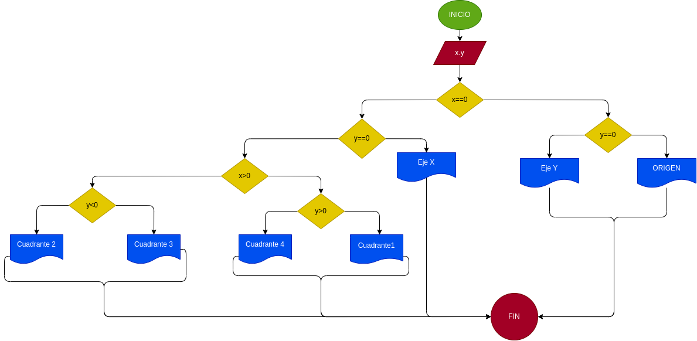

# instruciionescondicionales

# un programa lector de cordenadas cartesianas (x,y)de un puntoen en el plano y calcule el cuadrante el cual le pertenece un punto

# ANALISIS

variables de entrada y proceso (input, processing)

x,y: coordenadas del punto

variables de salida

Eje x
Eje y
Origen
Cuadrante 1
Cuadrante 2
Cuadrante 3
Cuadrante 4

Nos indica el punto exactoen el plano cartesiano

# DISEÑO

# CONSTRUCCION 