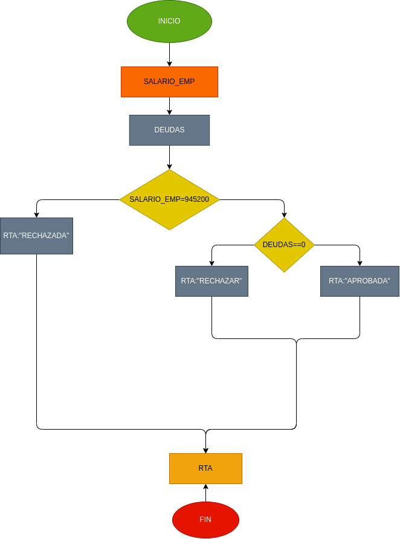

# Prestamo bancario

Programa para ver si usted puede adquirir un prestamo en el banco segun su salario y si tiene deudas anteriores

# ANALISIS

variables de entrada

Salario = el salario necesario para adquirir el prestamo
Deudas = saber si tiene deudas anteriores

variables de proceso

Salario >= numero ingresado
Deuda = si ono tienes deudas

variables de salida

Aceptado = su prestamo fue aceptado
Denegado = su prestamo fue denegado

nos indicara si se acepto o se denego su prestamo

# DISEÑO

# CONSTRUCCION