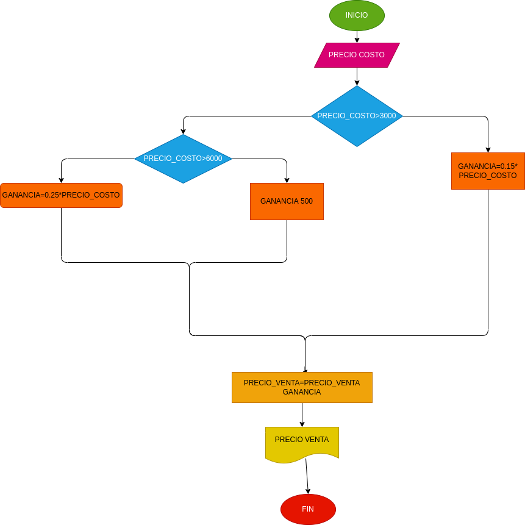

# Estructuras condicionales

programa que calcula el porcentaje de ganancia de ciertos productos dependiendo de su valor

# ANALISIS

variables de entrada y proceso (entrada, procesamiento)

precio_costo: necesario para sacar el porcentaje de los productos

variables de salida

precio_costo<3000 precio_costo< ganancia=o.15 precio_costo ganancia=0,25
precio_costo ganancia=500 precio_venta=precio_costo+ganancia

nos indicara cual es el valor final de los productos.

# DISEÑO

# CONSTRUCCION